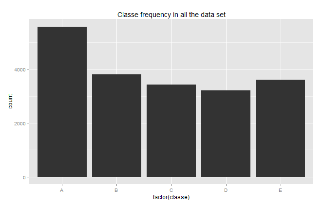

## Background

Using devices such as Jawbone Up, Nike FuelBand, and Fitbit it is now possible to collect a large amount of data about personal activity relatively inexpensively. These type of devices are part of the quantified self movement – a group of enthusiasts who take measurements about themselves regularly to improve their health, to find patterns in their behavior, or because they are tech geeks. One thing that people regularly do is quantify how much of a particular activity they do, but they rarely quantify how well they do it. In this project, your goal will be to use data from accelerometers on the belt, forearm, arm, and dumbell of 6 participants. They were asked to perform barbell lifts correctly and incorrectly in 5 different ways. More information is available from the website here: [http://groupware.les.inf.puc-rio.br/har](http://groupware.les.inf.puc-rio.br/har) (see the section on the Weight Lifting Exercise Dataset).  

## Data  


The training data for this project are available here: 

[https://d396qusza40orc.cloudfront.net/predmachlearn/pml-training.csv](https://d396qusza40orc.cloudfront.net/predmachlearn/pml-training.csv)

The test data are available here: 

[https://d396qusza40orc.cloudfront.net/predmachlearn/pml-testing.csv](https://d396qusza40orc.cloudfront.net/predmachlearn/pml-testing.csv)

The data for this project come from this source: [http://groupware.les.inf.puc-rio.br/har](http://groupware.les.inf.puc-rio.br/har). If you use the document you create for this class for any purpose please cite them as they have been very generous in allowing their data to be used for this kind of assignment. 

## What you should submit  

The goal of your project is to predict the manner in which they did the exercise. This is the "classe" variable in the training set. You may use any of the other variables to predict with. You should create a report describing how you built your model, how you used cross validation, what you think the expected out of sample error is, and why you made the choices you did. You will also use your prediction model to predict 20 different test cases.  

1. Your submission should consist of a link to a Github repo with your R markdown and compiled HTML file describing your analysis. Please constrain the text of the writeup to < 2000 words and the number of figures to be less than 5. It will make it easier for the graders if you submit a repo with a gh-pages branch so the HTML page can be viewed online (and you always want to make it easy on graders :-). 
2. You should also apply your machine learning algorithm to the 20 test cases available in the test data above. Please submit your predictions in appropriate format to the programming assignment for automated grading. See the programming assignment for additional details.  


```r

# library(httr)
# library(httpuv)
# if(!file.exists("./data")){dir.create("./data")}
# fileUrl <- "https://d396qusza40orc.cloudfront.net/predmachlearn/pml-training.csv"
# download.file(fileUrl,destfile="./data/pml-training.csv")
# fileUrl2 <- "https://d396qusza40orc.cloudfront.net/predmachlearn/pml-testing.csv"
# download.file(fileUrl,destfile="./data/pml-testing.csv")


```

## Exploratory data analysis  

The training data contains 19622 observations of 160 variables. The response variable is Classe a factor with 5 levels from A to E. 

```r
library(caret)
set.seed(88388)

training <- read.csv("~/data/pml-training.csv", na.strings=c("NA","#DIV/0!",""))
```

```r
dim(training)
```

```
## [1] 19622   160
```

```r
p <- qplot(factor(classe), data=training, geom="bar")
p + ggtitle("Classe frequency in all the data set")

dev.copy(png, file = "Plot_1.png", width = 1000, height = 800 ) # Saving Plot to local directory. then copy it to the figures folder in the local repository 
dev.off()
```
 

The response variable is quite balanced in the dataset, the most frecuent class is A, followed by B, E, C and D.

```r
str(training)
```
## Cleaning the data  
Using the `str` command suggest that there are many variables with missing values, we will select only the variables with less than 60% NAs.
We also have to get rid of the first variables, Unique ID, User, dates, times etc...

```r
train=training[,colSums(is.na(training))<(nrow(training)*0.6)]
dim(train)
str(train)
```

```r
dim(train)
```

```
## [1] 19622   60
```

```r
str(train)
```
```
## 'data.frame':    19622 obs. of  60 variables:
## $ X                   : int  1 2 3 4 5 6 7 8 9 10 ...
## $ user_name           : Factor w/ 6 levels "adelmo","carlitos",..: 2 2 2 2 2 2 2 2 2 2 ...
## $ raw_timestamp_part_1: int  1323084231 1323084231 1323084231 1323084232 1323084232 1323084232 1323084232 1323084232 1323084232 1323084232 ...
## $ raw_timestamp_part_2: int  788290 808298 820366 120339 196328 304277 368296 440390 484323 484434 ...
## $ cvtd_timestamp      : Factor w/ 20 levels "02/12/2011 13:32",..: 9 9 9 9 9 9 9 9 9 9 ...
## $ new_window          : Factor w/ 2 levels "no","yes": 1 1 1 1 1 1 1 1 1 1 ...
## $ num_window          : int  11 11 11 12 12 12 12 12 12 12 ...
## $ roll_belt           : num  1.41 1.41 1.42 1.48 1.48 1.45 1.42 1.42 1.43 1.45 ...
## $ pitch_belt          : num  8.07 8.07 8.07 8.05 8.07 8.06 8.09 8.13 8.16 8.17 ...
## $ yaw_belt            : num  -94.4 -94.4 -94.4 -94.4 -94.4 -94.4 -94.4 -94.4 -94.4 -94.4 ...
## $ total_accel_belt    : int  3 3 3 3 3 3 3 3 3 3 ...
## $ gyros_belt_x        : num  0 0.02 0 0.02 0.02 0.02 0.02 0.02 0.02 0.03 ...
## $ gyros_belt_y        : num  0 0 0 0 0.02 0 0 0 0 0 ...
## $ gyros_belt_z        : num  -0.02 -0.02 -0.02 -0.03 -0.02 -0.02 -0.02 -0.02 -0.02 0 ...
## $ accel_belt_x        : int  -21 -22 -20 -22 -21 -21 -22 -22 -20 -21 ...
## $ accel_belt_y        : int  4 4 5 3 2 4 3 4 2 4 ...
## $ accel_belt_z        : int  22 22 23 21 24 21 21 21 24 22 ...
## $ magnet_belt_x       : int  -3 -7 -2 -6 -6 0 -4 -2 1 -3 ...
## $ magnet_belt_y       : int  599 608 600 604 600 603 599 603 602 609 ...
## $ magnet_belt_z       : int  -313 -311 -305 -310 -302 -312 -311 -313 -312 -308 ...
## $ roll_arm            : num  -128 -128 -128 -128 -128 -128 -128 -128 -128 -128 ...
## $ pitch_arm           : num  22.5 22.5 22.5 22.1 22.1 22 21.9 21.8 21.7 21.6 ...
## $ yaw_arm             : num  -161 -161 -161 -161 -161 -161 -161 -161 -161 -161 ...
## $ total_accel_arm     : int  34 34 34 34 34 34 34 34 34 34 ...
## $ gyros_arm_x         : num  0 0.02 0.02 0.02 0 0.02 0 0.02 0.02 0.02 ...
## $ gyros_arm_y         : num  0 -0.02 -0.02 -0.03 -0.03 -0.03 -0.03 -0.02 -0.03 -0.03 ...
## $ gyros_arm_z         : num  -0.02 -0.02 -0.02 0.02 0 0 0 0 -0.02 -0.02 ...
## $ accel_arm_x         : int  -288 -290 -289 -289 -289 -289 -289 -289 -288 -288 ...
## $ accel_arm_y         : int  109 110 110 111 111 111 111 111 109 110 ...
## $ accel_arm_z         : int  -123 -125 -126 -123 -123 -122 -125 -124 -122 -124 ...
## $ magnet_arm_x        : int  -368 -369 -368 -372 -374 -369 -373 -372 -369 -376 ...
## $ magnet_arm_y        : int  337 337 344 344 337 342 336 338 341 334 ...
## $ magnet_arm_z        : int  516 513 513 512 506 513 509 510 518 516 ...
## $ roll_dumbbell       : num  13.1 13.1 12.9 13.4 13.4 ...
## $ pitch_dumbbell      : num  -70.5 -70.6 -70.3 -70.4 -70.4 ...
## $ yaw_dumbbell        : num  -84.9 -84.7 -85.1 -84.9 -84.9 ...
## $ total_accel_dumbbell: int  37 37 37 37 37 37 37 37 37 37 ...
## $ gyros_dumbbell_x    : num  0 0 0 0 0 0 0 0 0 0 ...
## $ gyros_dumbbell_y    : num  -0.02 -0.02 -0.02 -0.02 -0.02 -0.02 -0.02 -0.02 -0.02 -0.02 ...
## $ gyros_dumbbell_z    : num  0 0 0 -0.02 0 0 0 0 0 0 ...
## $ accel_dumbbell_x    : int  -234 -233 -232 -232 -233 -234 -232 -234 -232 -235 ...
## $ accel_dumbbell_y    : int  47 47 46 48 48 48 47 46 47 48 ...
## $ accel_dumbbell_z    : int  -271 -269 -270 -269 -270 -269 -270 -272 -269 -270 ...
## $ magnet_dumbbell_x   : int  -559 -555 -561 -552 -554 -558 -551 -555 -549 -558 ...
## $ magnet_dumbbell_y   : int  293 296 298 303 292 294 295 300 292 291 ...
## $ magnet_dumbbell_z   : num  -65 -64 -63 -60 -68 -66 -70 -74 -65 -69 ...
## $ roll_forearm        : num  28.4 28.3 28.3 28.1 28 27.9 27.9 27.8 27.7 27.7 ...
## $ pitch_forearm       : num  -63.9 -63.9 -63.9 -63.9 -63.9 -63.9 -63.9 -63.8 -63.8 -63.8 ...
## $ yaw_forearm         : num  -153 -153 -152 -152 -152 -152 -152 -152 -152 -152 ...
## $ total_accel_forearm : int  36 36 36 36 36 36 36 36 36 36 ...
## $ gyros_forearm_x     : num  0.03 0.02 0.03 0.02 0.02 0.02 0.02 0.02 0.03 0.02 ...
## $ gyros_forearm_y     : num  0 0 -0.02 -0.02 0 -0.02 0 -0.02 0 0 ...
## $ gyros_forearm_z     : num  -0.02 -0.02 0 0 -0.02 -0.03 -0.02 0 -0.02 -0.02 ...
## $ accel_forearm_x     : int  192 192 196 189 189 193 195 193 193 190 ...
## $ accel_forearm_y     : int  203 203 204 206 206 203 205 205 204 205 ...
## $ accel_forearm_z     : int  -215 -216 -213 -214 -214 -215 -215 -213 -214 -215 ...
## $ magnet_forearm_x    : int  -17 -18 -18 -16 -17 -9 -18 -9 -16 -22 ...
## $ magnet_forearm_y    : num  654 661 658 658 655 660 659 660 653 656 ...
## $ magnet_forearm_z    : num  476 473 469 469 473 478 470 474 476 473 ...
## $ classe              : Factor w/ 5 levels "A","B","C","D",..: 1 1 1 1 1 1 1 1 1 1 ...
```
```r
train=subset(train, select=-c(X,user_name,raw_timestamp_part_1,raw_timestamp_part_2,cvtd_timestamp,new_window,num_window))
dim(train)
```
```
## [1] 19622   53
```
```
## 'data.frame':	19622 obs. of  53 variables:
## $ roll_belt           : num  1.41 1.41 1.42 1.48 1.48 1.45 1.42 1.42 1.43 1.45 ...
## $ pitch_belt          : num  8.07 8.07 8.07 8.05 8.07 8.06 8.09 8.13 8.16 8.17 ...
## $ yaw_belt            : num  -94.4 -94.4 -94.4 -94.4 -94.4 -94.4 -94.4 -94.4 -94.4 -94.4 ...
## $ total_accel_belt    : int  3 3 3 3 3 3 3 3 3 3 ...
## $ gyros_belt_x        : num  0 0.02 0 0.02 0.02 0.02 0.02 0.02 0.02 0.03 ...
## $ gyros_belt_y        : num  0 0 0 0 0.02 0 0 0 0 0 ...
## $ gyros_belt_z        : num  -0.02 -0.02 -0.02 -0.03 -0.02 -0.02 -0.02 -0.02 -0.02 0 ...
## $ accel_belt_x        : int  -21 -22 -20 -22 -21 -21 -22 -22 -20 -21 ...
## $ accel_belt_y        : int  4 4 5 3 2 4 3 4 2 4 ...
## $ accel_belt_z        : int  22 22 23 21 24 21 21 21 24 22 ...
## $ magnet_belt_x       : int  -3 -7 -2 -6 -6 0 -4 -2 1 -3 ...
## $ magnet_belt_y       : int  599 608 600 604 600 603 599 603 602 609 ...
## $ magnet_belt_z       : int  -313 -311 -305 -310 -302 -312 -311 -313 -312 -308 ...
## $ roll_arm            : num  -128 -128 -128 -128 -128 -128 -128 -128 -128 -128 ...
## $ pitch_arm           : num  22.5 22.5 22.5 22.1 22.1 22 21.9 21.8 21.7 21.6 ...
## $ yaw_arm             : num  -161 -161 -161 -161 -161 -161 -161 -161 -161 -161 ...
## $ total_accel_arm     : int  34 34 34 34 34 34 34 34 34 34 ...
## $ gyros_arm_x         : num  0 0.02 0.02 0.02 0 0.02 0 0.02 0.02 0.02 ...
## $ gyros_arm_y         : num  0 -0.02 -0.02 -0.03 -0.03 -0.03 -0.03 -0.02 -0.03 -0.03 ...
## $ gyros_arm_z         : num  -0.02 -0.02 -0.02 0.02 0 0 0 0 -0.02 -0.02 ...
## $ accel_arm_x         : int  -288 -290 -289 -289 -289 -289 -289 -289 -288 -288 ...
## $ accel_arm_y         : int  109 110 110 111 111 111 111 111 109 110 ...
## $ accel_arm_z         : int  -123 -125 -126 -123 -123 -122 -125 -124 -122 -124 ...
## $ magnet_arm_x        : int  -368 -369 -368 -372 -374 -369 -373 -372 -369 -376 ...
## $ magnet_arm_y        : int  337 337 344 344 337 342 336 338 341 334 ...
## $ magnet_arm_z        : int  516 513 513 512 506 513 509 510 518 516 ...
## $ roll_dumbbell       : num  13.1 13.1 12.9 13.4 13.4 ...
## $ pitch_dumbbell      : num  -70.5 -70.6 -70.3 -70.4 -70.4 ...
## $ yaw_dumbbell        : num  -84.9 -84.7 -85.1 -84.9 -84.9 ...
## $ total_accel_dumbbell: int  37 37 37 37 37 37 37 37 37 37 ...
## $ gyros_dumbbell_x    : num  0 0 0 0 0 0 0 0 0 0 ...
## $ gyros_dumbbell_y    : num  -0.02 -0.02 -0.02 -0.02 -0.02 -0.02 -0.02 -0.02 -0.02 -0.02 ...
## $ gyros_dumbbell_z    : num  0 0 0 -0.02 0 0 0 0 0 0 ...
## $ accel_dumbbell_x    : int  -234 -233 -232 -232 -233 -234 -232 -234 -232 -235 ...
## $ accel_dumbbell_y    : int  47 47 46 48 48 48 47 46 47 48 ...
## $ accel_dumbbell_z    : int  -271 -269 -270 -269 -270 -269 -270 -272 -269 -270 ...
## $ magnet_dumbbell_x   : int  -559 -555 -561 -552 -554 -558 -551 -555 -549 -558 ...
## $ magnet_dumbbell_y   : int  293 296 298 303 292 294 295 300 292 291 ...
## $ magnet_dumbbell_z   : num  -65 -64 -63 -60 -68 -66 -70 -74 -65 -69 ...
## $ roll_forearm        : num  28.4 28.3 28.3 28.1 28 27.9 27.9 27.8 27.7 27.7 ...
## $ pitch_forearm       : num  -63.9 -63.9 -63.9 -63.9 -63.9 -63.9 -63.9 -63.8 -63.8 -63.8 ...
## $ yaw_forearm         : num  -153 -153 -152 -152 -152 -152 -152 -152 -152 -152 ...
## $ total_accel_forearm : int  36 36 36 36 36 36 36 36 36 36 ...
## $ gyros_forearm_x     : num  0.03 0.02 0.03 0.02 0.02 0.02 0.02 0.02 0.03 0.02 ...
## $ gyros_forearm_y     : num  0 0 -0.02 -0.02 0 -0.02 0 -0.02 0 0 ...
## $ gyros_forearm_z     : num  -0.02 -0.02 0 0 -0.02 -0.03 -0.02 0 -0.02 -0.02 ...
## $ accel_forearm_x     : int  192 192 196 189 189 193 195 193 193 190 ...
## $ accel_forearm_y     : int  203 203 204 206 206 203 205 205 204 205 ...
## $ accel_forearm_z     : int  -215 -216 -213 -214 -214 -215 -215 -213 -214 -215 ...
## $ magnet_forearm_x    : int  -17 -18 -18 -16 -17 -9 -18 -9 -16 -22 ...
## $ magnet_forearm_y    : num  654 661 658 658 655 660 659 660 653 656 ...
## $ magnet_forearm_z    : num  476 473 469 469 473 478 470 474 476 473 ...
## $ classe              : Factor w/ 5 levels "A","B","C","D",..: 1 1 1 1 1 1 1 1 1 1 ...
```


```r
str(train)
```

We have now only 52 explanatory variables in numeric and integer format and the response variable

# Training the model.  
We will create the training and testing partitions, take samples of 1000 rows for train a random forest model, we expect this is the best method.

```r
inTrain <- createDataPartition(train$classe, p=0.7,list=FALSE) 
length(inTrain)
```
```
## [1] 13737
```
```r
inTrain=sample(inTrain,size=1000,replace=FALSE) #subset for testing
training <- train[inTrain,]
testing <- train[-inTrain,]
testing=testing[sample(nrow(testing), 1000),] #random rows
modelrf=train(classe~.,data=training,method="rf")
modelrf
```
```
## Random Forest 
## 
## 1000 samples
##   52 predictor
##    5 classes: 'A', 'B', 'C', 'D', 'E' 
## 
## No pre-processing
## Resampling: Bootstrapped (25 reps) 
## 
## Summary of sample sizes: 1000, 1000, 1000, 1000, 1000, 1000, ... 
## 
## Resampling results across tuning parameters:
## 
##   mtry  Accuracy   Kappa      Accuracy SD  Kappa SD  
##    2    0.8731599  0.8393933  0.02151709   0.02712306
##   27    0.8744003  0.8410780  0.02130680   0.02693036
##   52    0.8598178  0.8227278  0.02561341   0.03226698
## 
## Accuracy was used to select the optimal model using  the largest value.
## The final value used for the model was mtry = 27. 
```

The random forest model accuracy is pretty good (85-87%), and the kappa index is acceptable, ranging from .82 to .84.  

##Testing error estimation  
We need now to get the testing error.  

```r
predictions=predict(modelrf,newdata=testing)
accuracy=sum(predictions == testing$classe)/length(testing$classe) #or:
confusionMatrix(predictions,testing$classe)
```
```
## Confusion Matrix and Statistics
## 
##           Reference
## Prediction   A   B   C   D   E
##          A 246   9   0   3   0
##          B  11 170   6   0   7
##          C   8   8 178  11   8
##          D   6   3   4 140   2
##          E   4   0   0   2 174
## 
## Overall Statistics
##                                           
##                Accuracy : 0.908           
##                  95% CI : (0.8884, 0.9252)
##     No Information Rate : 0.275           
##     P-Value [Acc > NIR] : < 2.2e-16       
##                                           
##                   Kappa : 0.8841          
##  Mcnemar's Test P-Value : 0.0001376       
## 
## Statistics by Class:
## 
##                      Class: A Class: B Class: C Class: D Class: E
## Sensitivity            0.8945   0.8947   0.9468   0.8974   0.9110
## Specificity            0.9834   0.9704   0.9569   0.9822   0.9926
## Pos Pred Value         0.9535   0.8763   0.8357   0.9032   0.9667
## Neg Pred Value         0.9609   0.9752   0.9873   0.9811   0.9793
## Prevalence             0.2750   0.1900   0.1880   0.1560   0.1910
## Detection Rate         0.2460   0.1700   0.1780   0.1400   0.1740
## Detection Prevalence   0.2580   0.1940   0.2130   0.1550   0.1800
## Balanced Accuracy      0.9390   0.9326   0.9519   0.9398   0.9518
```
In the testing subset the random forest model gets 90.8% accuracy.  
 
Maybe there is information redundancy, we can reduce the predictors to the first 20 variables in importance to the model.  

```r
varImp(modelrf)
```
```
## rf variable importance
## 
##   only 20 most important variables shown (out of 52)
## 
##                      Overall
## roll_belt            100.000
## pitch_forearm         75.713
## yaw_belt              49.076
## magnet_dumbbell_y     42.059
## magnet_dumbbell_z     39.389
## roll_forearm          30.350
## pitch_belt            25.810
## roll_dumbbell         21.055
## accel_forearm_x       18.794
## magnet_dumbbell_x     17.294
## accel_dumbbell_y      17.130
## magnet_belt_z         14.764
## magnet_forearm_z      12.310
## total_accel_dumbbell  11.069
## accel_belt_z          10.880
## magnet_belt_y         10.827
## gyros_belt_z          10.736
## accel_dumbbell_x       9.774
## accel_dumbbell_z       9.713
## roll_arm               9.118
```
```r
inTrain <- createDataPartition(train$classe, p=0.7,list=FALSE) 
length(inTrain)
```
```
## [1] 13737
```
```r
training <- train[inTrain,]
testing <- train[-inTrain,]
training=subset(training,select=c(roll_belt,pitch_forearm,magnet_dumbbell_z,magnet_dumbbell_y,yaw_belt,pitch_belt,roll_forearm,magnet_dumbbell_x,roll_dumbbell,magnet_belt_z,accel_forearm_x,accel_dumbbell_y,gyros_dumbbell_y,roll_arm,magnet_belt_x,accel_belt_z,magnet_belt_y,accel_dumbbell_z,magnet_forearm_x ,magnet_forearm_x,total_accel_dumbbell,classe))
testing=subset(testing,select=c(roll_belt,pitch_forearm,magnet_dumbbell_z,magnet_dumbbell_y,yaw_belt,pitch_belt,roll_forearm,magnet_dumbbell_x,roll_dumbbell,magnet_belt_z,accel_forearm_x,accel_dumbbell_y,gyros_dumbbell_y,roll_arm,magnet_belt_x,accel_belt_z,magnet_belt_y,accel_dumbbell_z,magnet_forearm_x ,magnet_forearm_x,total_accel_dumbbell,classe))
dim(training)
```
```
## [1] 13737    22
```
```r
modelrf=train(classe~.,data=training,method="rf")
modelrf
```
```
## Random Forest 
## 
## 13737 samples
##    21 predictor
##     5 classes: 'A', 'B', 'C', 'D', 'E' 
## 
## No pre-processing
## Resampling: Bootstrapped (25 reps) 
## 
## Summary of sample sizes: 13737, 13737, 13737, 13737, 13737, 13737, ... 
## 
## Resampling results across tuning parameters:
## 
##   mtry  Accuracy   Kappa      Accuracy SD  Kappa SD   
##    2    0.9843594  0.9802181  0.001376329  0.001736921
##   11    0.9830874  0.9786112  0.001950514  0.002462088
##   21    0.9744506  0.9676865  0.002895704  0.003661132
## 
## Accuracy was used to select the optimal model using  the largest value.
## The final value used for the model was mtry = 2. 
```
The accuracy with the entire dataset is about 98% and kappa index 0.98

The accuracy with the entire dataset is about 98%.  

##Training all data with repeated crossvalidation  
To get the out-of-sample error estimate we will train a random forest on the whole training data using cross-validation, specifically 10 fold repeated cross validation.

```r
fitControl <- trainControl(method = "repeatedcv", 
                           number = 10, repeats = 10)
model=train(classe~.,data=training,method="rf",trControl=fitControl)
model
```
```
## Random Forest 
## 
## 13737 samples
##    21 predictor
##     5 classes: 'A', 'B', 'C', 'D', 'E' 
## 
## No pre-processing
## Resampling: Cross-Validated (10 fold, repeated 10 times) 
## 
## Summary of sample sizes: 12363, 12363, 12365, 12362, 12365, 12361, ... 
## 
## Resampling results across tuning parameters:
## 
##   mtry  Accuracy   Kappa      Accuracy SD  Kappa SD   
##    2    0.9878864  0.9846760  0.003124205  0.003952947
##   11    0.9882870  0.9851840  0.002618814  0.003313093
##   21    0.9812479  0.9762791  0.003730344  0.004720301
## 
## Accuracy was used to select the optimal model using  the largest value.
## The final value used for the model was mtry = 11. 
```
We get both accuracy and kappa values of 0.98 in the repeated crossvalidation


##Final model applied to the test data


```r
model=train(classe~.,data=training,method="rf")
predictions=predict(model,newdata=testing)
accuracy=sum(predictions == testing$classe)/length(testing$classe)
accuracy
```
```
## [1] 0.9925234
```
```r
confusionMatrix(predictions,testing$classe)
```
```
## Confusion Matrix and Statistics
## 
##           Reference
## Prediction    A    B    C    D    E
##          A 1669    6    0    0    0
##          B    5 1124    4    0    2
##          C    0    9 1018    6    3
##          D    0    0    4  956    3
##          E    0    0    0    2 1074
## 
## Overall Statistics
##                                         
##                Accuracy : 0.9925        
##                  95% CI : (0.99, 0.9946)
##     No Information Rate : 0.2845        
##     P-Value [Acc > NIR] : < 2.2e-16     
##                                         
##                   Kappa : 0.9905        
##  Mcnemar's Test P-Value : NA            
## 
## Statistics by Class:
## 
##                      Class: A Class: B Class: C Class: D Class: E
## Sensitivity            0.9970   0.9868   0.9922   0.9917   0.9926
## Specificity            0.9986   0.9977   0.9963   0.9986   0.9996
## Pos Pred Value         0.9964   0.9903   0.9826   0.9927   0.9981
## Neg Pred Value         0.9988   0.9968   0.9984   0.9984   0.9983
## Prevalence             0.2845   0.1935   0.1743   0.1638   0.1839
## Detection Rate         0.2836   0.1910   0.1730   0.1624   0.1825
## Detection Prevalence   0.2846   0.1929   0.1760   0.1636   0.1828
## Balanced Accuracy      0.9978   0.9923   0.9942   0.9951   0.9961
```

In the test data the accuracy IC is (0.99, 0.9946), andthe kappa index is ranging from 0.98688 in class B to 0.9970 in class A.


##Predicting the Classe variable in the testing data

We now need to execute the predictions on the blind data, first we select only the variables in the model.

```r
testing <- read.csv("~/data/pml-testing.csv", header=TRUE, na.strings=c("NA","#DIV/0!",""))

testing=subset(testing,select=c(roll_belt,pitch_forearm,magnet_dumbbell_z,magnet_dumbbell_y,yaw_belt,pitch_belt,roll_forearm,magnet_dumbbell_x,roll_dumbbell,magnet_belt_z,accel_forearm_x,accel_dumbbell_y,gyros_dumbbell_y,roll_arm,magnet_belt_x,accel_belt_z,magnet_belt_y,accel_dumbbell_z,magnet_forearm_x ,magnet_forearm_x,total_accel_dumbbell))
dim(testing)
```
```
## [1] 20 21
```
```r
predictTest=predict(model,newdata=testing)
length(predictTest)
```
```
## [1] 20
```
```r
pml_write_files = function(x){
  n = length(x)
  for(i in 1:n){
    filename = paste0("problem_id_",i,".txt")
    write.table(x[i],file=filename,quote=FALSE,row.names=FALSE,col.names=FALSE)
  }
}
pml_write_files(predictTest)
```